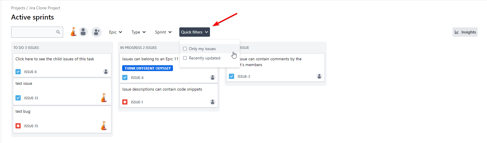

<h1 align="center">Jira Clone built with React and Next.js 13 (app dir)</h1>

The source repository is here `https://github.com/sebastianfdz/jira_clone`.

**This repo is extended with several new filters:**
- added new section Quick filters;
- added new filters: "My issues only" and "Recently updated"
- fixed errors in console related to displaying checkboxes

## Features
- Written in modern React
- Uses Next js 13.4 app directory structure
- Explores basic React Server Components
- Full user authentication lifecycle with Clerk
- Rate limiting with upstash to avoid spamming
- Modern data fetching using React-Query
- Simple local React state management, without redux, mobx, or similar
- Uses Radix UI library for unstyled components and Tailwind for styling
- Uses Prisma ORM for database modeling
- Entire app written with typescript
- End to end type safety with Zod

## Setting up development environment

Project uses Prisma, you can decide which database to use. \*By default it uses the 'mysql' provider
- `git clone https://github.com/AlyaTatarinova13/jira_clone`
- create an empty `.env` file inside the root dir `/`, copy `/.env.example` contents into it.
- `npm install`
- install and set **MySQL**, create an empty DB, update `.env` with DB URL (https://www.prisma.io/docs/reference/database-reference/connection-urls#env)
- create a **Clerk** account, create an application there, update `.env` with public and secret keys (https://clerk.com/docs/nextjs/set-environment-keys)
- create **Upstash** account, create a db there, update `.env` with url and token (https://console.upstash.com/)
- `npx prisma generate`
- `npx prisma migrate dev --name init`
- `npx prisma db seed`
- lookup 'USE THIS IF RUNNING LOCALLY' inside the project and follow the instructions.
- `npm run dev`
- The app should now be running on `http://localhost:3000/`
